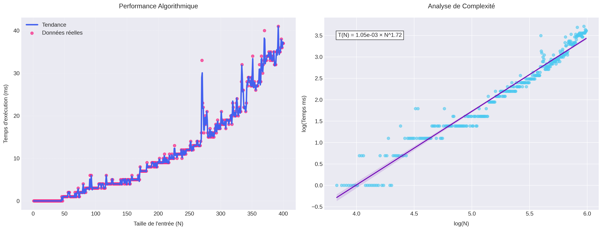

        ## Rapport d'Analyse SMP

        **Paramètres**:
        - Plage de N: 1 à 400
        - Nombre de points: 400
        - Temps moyen: 11.81 ms
        - Temps max: 41.00 ms

        **Analyse de complexité**:
        T(N) = 1.05e-03 × N^1.72

        
        